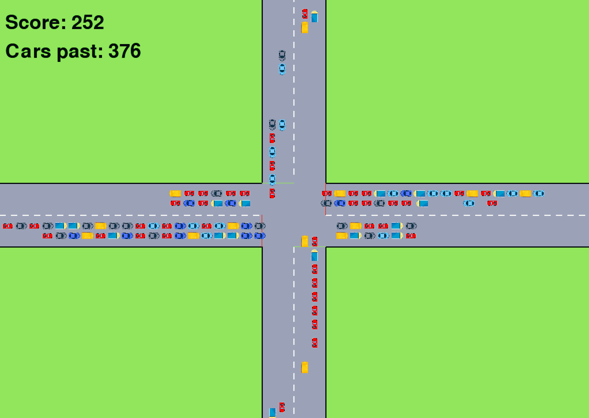

# Traffic control
A environment based on ```pygame``` and ```gymnasium``` (OpenAI open source library), which allows to train RL-agents to optimize traffic control at a crossing. The entire implementation has been coded from scratch, together with the rendering. The project has been developed together with O. Girardin for the Reinforcement Learning course at CentraleSupélec (Paris-Saclay).

<div align="center">

</div>

Different Q-learning based algorithms have been evaluated, whose results are displayed in the report. These are tabular Q-learning based on dynamic programming, Semi-Gradient function approximation based on tilings and Deep Q-Network with policy and target networks (which solves the environment).


## Main files
```main.py```: for visualizing environment and playing with the user interface

```agents.ipynb```: notebook for agent learning, for all different configurations

```report.pdf```: written report containing the results and full explanation of how the environment works

```traffic_control_game```: folder containing game logic and rendering
